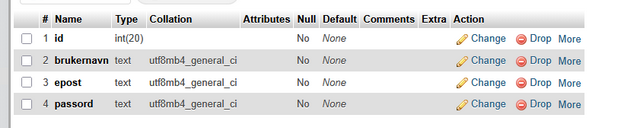
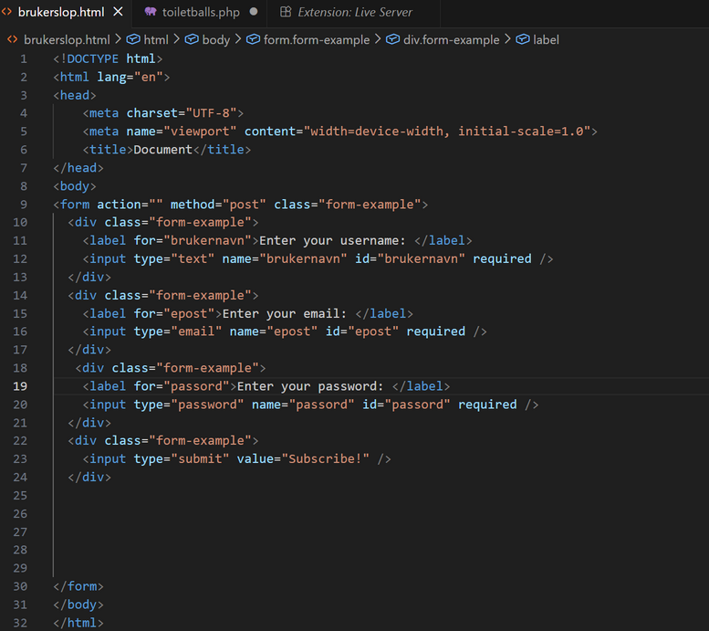
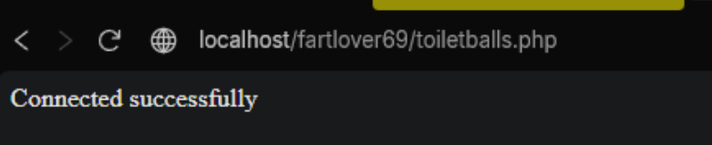
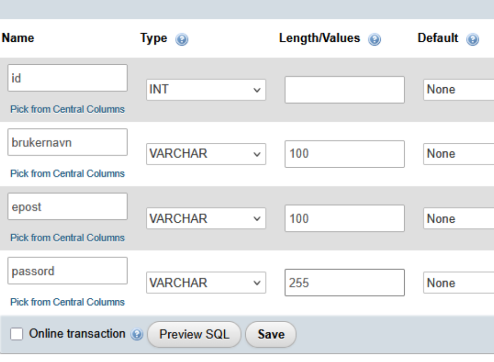
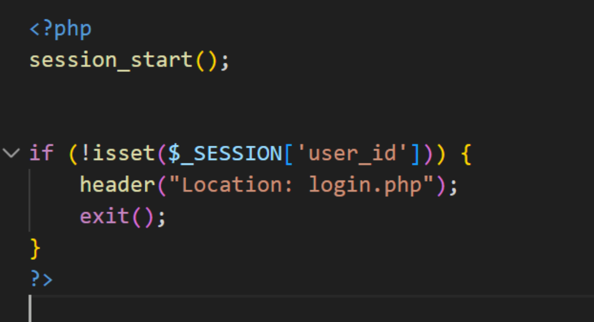

Brukerregistrering oppgave dokumentasjon 

Satt opp apache å mysqll via XAMPP 

Satt op tabell for brukere med navn 

Satt opp html fil for registrering via mozilla mdn 

D
 

Satt opp php fil via w3schools 

 

 

Koblet php til mysql 

 

 

 

Forrandret noen properties i tabellen i databasen‘ 

 

Satt opp proper login, register å en landing page’ 

Fikset at man kan komme seg til landing pagen uten å ha logget inn 

 

 

 

Adda kunst til alle sidene 

 

Ferdig :) 